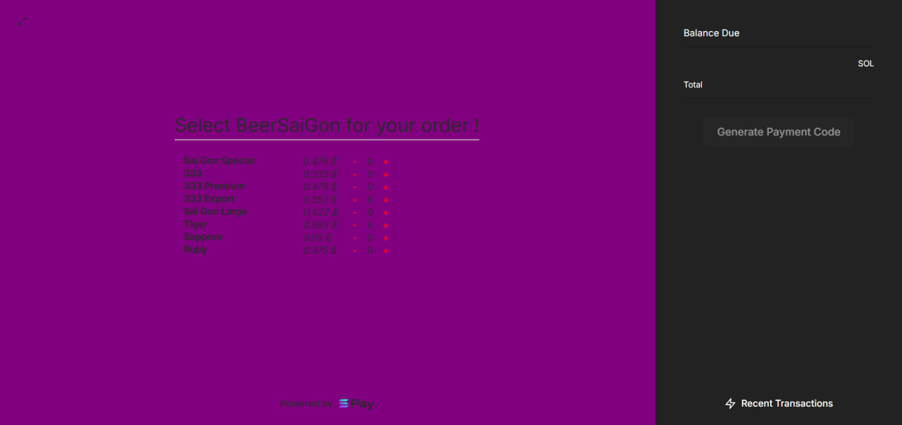
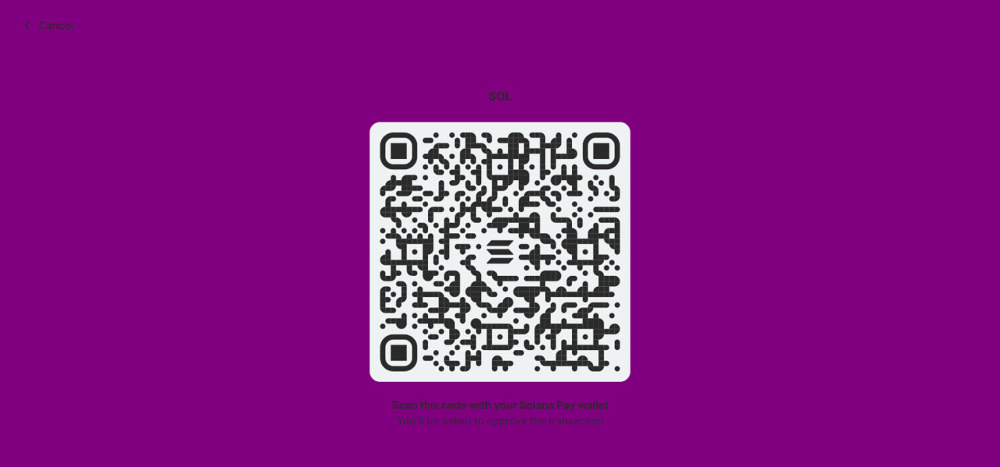

"# pos-beer-saigon" 
# POS Beer Saigon

This is a POS (Point of Sale) project for selling beer in Saigon, using Solana blockchain technology.

## Step to run the project

1. Clone the repository
2. Run `pnpm install`
3. Run `pnpm run dev`

4. Open [http://localhost:3000](http://localhost:3000) to view it in the browser.

## Image

*UI Home Page*

*UI POS Page*

*UI Payment Page*

## Description

POS Beer Saigon is an application that allows users to select and pay for popular beers in Saigon using Solana cryptocurrency. This project aims to demonstrate the ability to integrate blockchain technology into everyday transactions.

## Features

- List of popular beers in Saigon
- Automatic price calculation based on the number of beers selected
- Payment via Solana through QR code
- User-friendly and easy-to-use interface

## Installation and Usage

(Add installation and usage instructions here)

## Contributions

We welcome all contributions to improve the project. Please create an issue or pull request if you have any ideas or improvements.

## License

This project is distributed under the [MIT License](LICENSE).

## Acknowledgements

This project is developed based on the original source code from [Solana Pay Point of Sale](https://github.com/Laugharne/ssf_s6_exo). We sincerely thank the Solana community and developers who contributed to the original project, providing the foundation for us to build this application.
